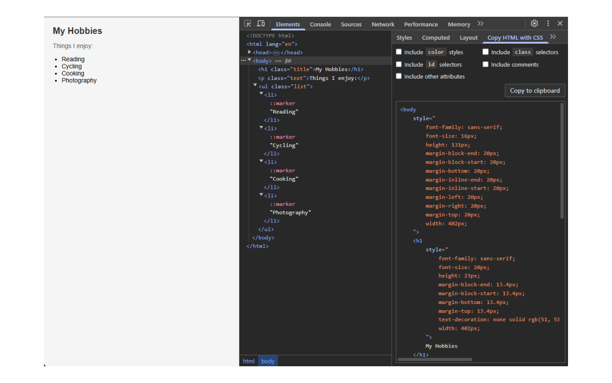

# Copy HTML with CSS

A Chrome/Firefox/Edge DevTools extension that lets you copy the HTML of a selected element along with its computed CSS (converted into inline styles). Useful for prototyping, debugging layout issues, or sharing styled snippets.

---

## Features

- Adds a sidebar panel in Chrome/Firefox/Edge DevTools → **Elements** tab
- When you select an element, you can copy the element’s HTML **plus** all its computed CSS as inline styles
- Options to filter out unwanted CSS properties or hide certain elements before copying
- Lightweight, minimal UI
- No data collection — all operations run locally in your browser

---

## Screenshots

